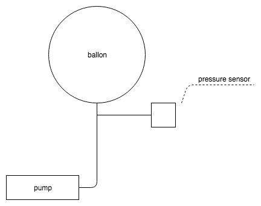

# Size-Pressure Experiment

The directory contains data on size-pressure dependency measurements. The size and pressure measured both for balloon inflation and deflation. 18" and 36" balloons have been used in the experiment.

# Schema

BMP180 has been used as pressure sensor.
